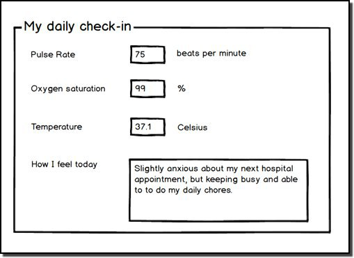

# Getting Started with an openEHR CDR using React, ES6 Javascript and Axios

This article will take a look at how to get started working with an openEHR Clinical Data Repository 'CDR' via a REST API.

It uses examples written for React using ES6 Javascript and the [Axios](https://github.com/axios/axios) library, and uses the aysync-await pattern to handle asynchronous calls to the CDR. The examples should be relatively easily translated to other languages or libraries, as the REST calls are themselves pretty simple.

In this series we will only take you through the basic interactions with a CDR. Subsequent series we will look in more depth at topics such as 'how do the data models/schema get created?', 'how does the query language work?' etc.

## What is an openEHR CDR?

An openEHR CDR is best thought of a highly adaptable datastore for structured clinical data - e.g allergies, observation, problems. Critically, although the CDR will internally have some sort of database/persistence engine, as an app developer you will never interact with it directly. All interactions are through a service layer which presents and receives the clinical data as part of a logical data model.

This abstraction of the physical database means that applications or systems built on one CDR should be able to run on any other compliant CDR, even though the vendor and/or underlying database technology is completely different.

Critically, the CDR must be capable of accepting new clinical data schema definitions, without requiring any re-engineering by the CDR vendor. In this way , the data and the data definitions become wholly vendor/tech-neutral, and the CDR can be very quickly adapted to cope with new kinds of clinical data.

Every openEHR-based CDR supports a identical basic logical structure for **all** patient data. It is the job of the CDR implementer to decide how best to engineer their system to persist,retreive and query the data, querying being done via a vendor/database-agnostic query language known as **AQL** (Archetype Query Language).

#### CDR logical structure

A simplified version of the logical strucure of an openEHR CDR, with some example values, looks something like this ...

John Smith has an electronic heath record, containing a 'Problem List' document, which has one 'Problem / diagnosis' record, with a name  'Asthma' and a 'Date of Onset' of '1968-09-01'  

```yml

CDR (baseUrl = "cdr.code4health.org')

    EHR (Mr John Smith:  ehr_id = '123456' )

       COMPOSITION ( name = 'Problem List')

         ENTRY (name = "Problem / diagnosis")

            ELEMENT (name 'Problem / diagnosis name' value='Asthma)

            ELEMENT (name  = 'Date of onset')

```


                	

#### CDR 'schema' and 'design-time' artefacts

In essence the logical pattern above (EHR-COMPOSITION-ENTRY-ELEMENT) forms the basis of the low-level [openEHR Reference Model]() and associated [schema]() to which all persisted patient data must conform. 

In practice this is always modified by locally applied **'templates'**, themsleves made up of shareable **'archetype'** components which apply further constraints on the basic data model, and which carry nearly all of the clinical content definitions.

```json
CDR (url = "cdr.code4health.org')

    EHR (Mr John Smith:  ehr_id = '123456' )

       COMPOSITION ( archetypeID='openEHR-EHR-COMPOSITION.problem_list.v1' name = "Problem List")

         ENTRY (archetype_id= 'openEHR-EHR-EVALUATION.problem_diagnosis.v1' name = "Problem / diagnosis")

           ELEMENT (name "Problem / diagnosis name" value='asthma' )

                value " Asthma"

	   ELEMENT (name  = 'Date of onset')

                value " 1968-09-01
```

In some ways it helps to think of the interaction of the base technical layer and the archetype/template layer as similar tothe way that the base HTML/DOM object model can be overlain with CSS or other higher-level frameworks. i.e archetypes and templates are an object constraint mechanism. The key aspect here is that the archetypes and templates act as a further layer of validation when data is submitted tothe CDR. That data must be conformant both to the basic RM schema, and to the additional constraints defined by the template applied.

You can see examples of archetypes and templates at the [Apperta CKM] and [international CKM] but for now, we will just assume the the CDR is already pre-loaded with the archetypes and templates required for this project. In fact, this will be fairly common in practice - as in the openEHR world it is primarily the job of clinicians and clinical informaticians to design and eploy the data models, not the the developers.

### The openEHR REST API

CDR Vendors normally support various kinds of service e.g. java/.net facades, SOAP, REST  but we will  looking at here at the interface currently used by the [Code4Health Platform]() ,the [Ehrscape API]() developed by [Marand]() and shared by [Ripple EtherCis](). 

Although this is a proprietary interface, Ehrscape is structurally and conceptually very close to the standard cross-vendor [openEHR REST API]() currently being adopted by all of the leading openEHR CDR vendors. The Code4Health Platform uses the Ehrscape interface but we expect it to support the formal openEHR Rest interface in the very near future.  Although some change will be required, the basic principles and resources are identical. The Ehrscape API does include somew resources that are unique to the Marand CDR and not part of the openEHR specification but will not be making use of these in this project, so you should be able to use either a Marand Think!Ehr CDr or a Ripple Ethercis CDR as and end-poinrt with only some very minor adjustments.

### Key Rest API Resources

#### /session

Session is purely used to create sesson token for authnetication purposes.  It is planned to be deprecated in favour of JWT in the near future.

#### /template

We will look only briefly at `/template`, to list the templates registered with our CDR via a GET call but it is also the mechanism for registering new templates via POST 

#### /ehr

The `/ehr`resource reflect the top-level EHR object in the CDR. Essentially the EHR is the top-level container of all of the records for a single patient. When we register a new patient with the CDR we have to supply some sort of external identifier, such an NHS Number or hospital number (MRN) and the CDR will creat an EHRobject with an associated ehr_id via POST /ehr call. 

On subsequent interactions we normally lookup the ehr_id from the external id via a GET call.   

#### /composition

All of the data persisted within the EHR object is contained in Composition objects, and the job of the developer is essntially to construct that object and then send it as a POST making sure that the object and data values are conformant to the RM and the template associated with the composition. If the object or data values are invalid the CDR will reject the POST.

In our project we will be posting JSON objects aligned to the 'Home Chemo encounter.v1' template.

When you succesfully POST a composition, the CDR will return a unique identifier for that composition. Yoiu can retreive the whole composition object at any time by doing a GET, specifying the composition uid.

However you can also do more granular and cross-compositon queries on parts of the composition object via the /query resource.

#### /query

The query resource is only used to send Archetype Query Language (AQL) statements to the CDR and retreive the results via a `resultSet` object. 

AQL is perhaps the most powerful part of openEHR but it also the most compex and unusual for people new to the subject. In this article we will wokr with a fixed AQL statement but not worry too mch about how it is put together. Just think of it as the openEHR equivalent of SQL but one which is model-driven not database-driven.

Functionally, GET and POST are identical. We recommend using POST as it is not subject ot possible url length limitations that can be encountered with GET.

Although these are Ehrscape API calls, a quick comparison of the formal openEHR REST definitions will show how close they are, both syntactically and functionally.

### The 'chemoApp' Project

In this project we will work with an example of a simple dataset that allows us to store some text notes from the patient along with some simple results which they may have collected from a home device temperature, pulse, oxygen saturations. A real-world scenario might be a patient on chemotherapy who is collecting this data via a mobile app, and storing it in the openEHR CDR, in order for their clinician(s) to view and comment on it. 



#### Project Tasks ...

We will need to..

1. Authenticate with the openEHR CDR
2. List the 'templates' available (just to check we have access)
3. Create an Ehr object for a new Patient
4. Lookup the ehr_id for that new patient
5. Submit a new 'ChemoApp' Composition to the CDR for that patient
6. Read back the submitted Composition as a JSON object 
7. Run an AQL query to pull back some scalar data points from that Composition.

We will not actually be building the app here, just showing how the app developer would interact with the CDR.

### Setup

We will use a simple React starter app to showcase how this all works.

##### Prerequisites

1. git 

2. npm >= 5.2 

3. nodejs


#### Installing the baseline React App

 See more details at [Create a New React App](https://reactjs.org/docs/create-a-new-react-app.html).

1. Open a terminal console at a convenient place in your folders and run

   	`npx create-react-app cdr-demo` 

2. Change into the 'cdr-demo' folder

   	`cd cdr-demo`

3. add the [Axios](https://github.com/axios/axios) http library

   	`yarn add axios`

4. If this has all gone smoothly then you should be able to start the app with

   	`yarn start`

You should now see the generic Create React app running on your broswer at `localhost:3000`

The app uses hot-reloading so you shoud be able to make changes to the code on the fly and watch it change in the UI. As an example open `./src/app.js`and change

```javascript
<h1 className="App-title">Welcome to React App</h1>
```

to

```javascript
<h1 className="App-title">Welcome to openEHR CDR Demo</h1>
```

and after a short period the UI should update.

#### IntelliJ Webstorm

I use the IntelliJ Webstorm IDE as I prefer old-style help with debugger functions but you can use any text editor and the browser console debugging features if you prefer. None of the examples are dependent on WebStorm.

If you want to use WebStorm, choose Open from the opening menu or File->Open and navigate to the `cdr-demo` folder then open. WebStorm will take a few minutes to index the files.

You should also setup a remote Javascript Debugger Configuration, which is a simple as pointing the URL at localhost:3000...


You will then be able to set Breakpoints and watch variables inside Webstorm.

#### Sample code

All of the code for this project is at

`git clone https://github.com/inidus/cdr-react-demo.git`

#### Handling Asynchronous calls in javascript

This project makes heavy use of remote REST API calls which are asychronous and need to be handled carefully in javascript which will normally not 'wait' for these to complete. Coming from a non-javascript background I found this really confusing!

This has been made a lot easier with the introduction of Async/await in ES6, based on 'Promises'. Detailed discussion is beyond the scope of this article but you will find many useful articles on the web such as [Truly understanding Async/Await](https://medium.com/@rafaelvidaurre/truly-understanding-async-await-491dd580500e). The axios library is fully Promise and Async/await enabled.


